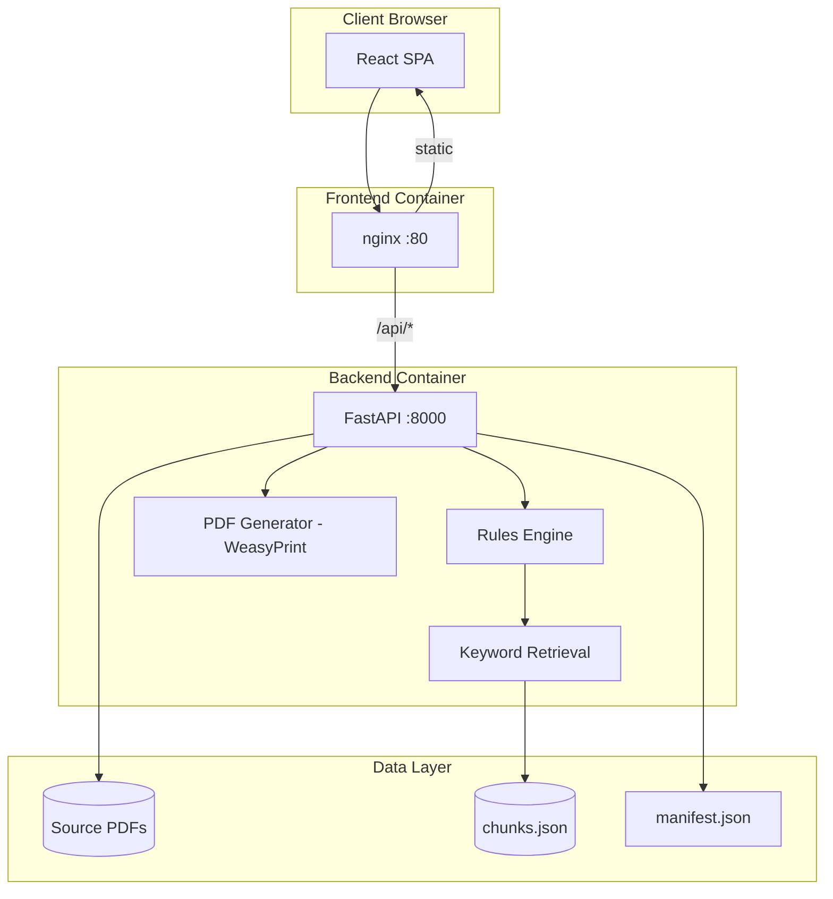

# DPDP Phase 1 — Complete Project Documentation

**Product name:** DPDP Compliance Guidance Generator  
**Version:** 1.0 (Phase 1 MVP)  
**Repository:** [github.com/sahlaca/dpdp-phase1](https://github.com/sahlaca/dpdp-phase1)  
**Last updated:** July 2026

---

## Table of contents

1. [Executive summary](#1-executive-summary)
2. [Problem statement](#2-problem-statement)
3. [Solution overview](#3-solution-overview)
4. [Target users](#4-target-users)
5. [Regulatory context](#5-regulatory-context)
6. [Product scope](#6-product-scope)
7. [System architecture](#7-system-architecture)
8. [Technology stack](#8-technology-stack)
9. [Project structure](#9-project-structure)
10. [Data flow](#10-data-flow)
11. [Questionnaire design](#11-questionnaire-design)
12. [Obligation engine](#12-obligation-engine)
13. [Legal knowledge base](#13-legal-knowledge-base)
14. [Report output](#14-report-output)
15. [API reference](#15-api-reference)
16. [Deployment](#16-deployment)
17. [Security and privacy](#17-security-and-privacy)
18. [Limitations and disclaimers](#18-limitations-and-disclaimers)
19. [Roadmap (Phase 2+)](#19-roadmap-phase-2)
20. [Setup and operations](#20-setup-and-operations)

---

## 1. Executive summary

The **DPDP Compliance Guidance Generator** is a web application that helps Indian small and medium enterprises (SMEs) understand their obligations under the **Digital Personal Data Protection Act, 2023** and **DPDP Rules, 2025**.

A business completes a structured questionnaire about its data practices and receives a **personalized compliance gap report** — identifying which obligations apply, where gaps exist, and a prioritized action plan aligned to regulatory deadlines (November 2026 and May 2027).

The system uses **deterministic rule-based scoring** (not LLM-based decisions) grounded in official legal source documents that users can download and verify.

---

## 2. Problem statement

### The problem

Indian businesses — particularly SMEs in hospitality, retail, healthcare, D2C, and related sectors — are subject to the DPDP Act and Rules, with a hard compliance deadline of **May 13, 2027**. However:

- Most are **unaware** the law applies to them
- Even when aware, they lack **legal expertise, time, or budget** to interpret dense legal text
- Generic blog content does not tell them what **they specifically** need to do
- Hiring lawyers or consultants is **expensive and slow** relative to business scale
- Doing nothing exposes them to **penalties and breach risk**
- Generic checklists do not reflect their actual data practices

### What Phase 1 solves

A business answers a structured questionnaire and receives a **personalized, legally-grounded compliance gap report** — without reading the Act themselves or hiring a consultant for initial orientation.

### Success criterion

A business owner with **zero prior DPDP awareness** (e.g. a hotel operator) can, in a few minutes, understand:

- What applies to them
- Where they fall short today
- What to fix first and by when

### Relationship to Phase 2 (future)

| Phase | Question answered |
|-------|-------------------|
| **Phase 1** (this project) | *What do I need to do and why?* |
| **Phase 2** (planned) | *How do I actually do it every day?* (consent management, data inventory, breach workflows, integrations) |

---

## 3. Solution overview

```
┌─────────────────┐     ┌──────────────────┐     ┌─────────────────────┐
│  Questionnaire  │────▶│  Rules engine    │────▶│  Gap report (PDF)   │
│  (33 questions) │     │  (39 obligations)│     │  + action plan      │
└─────────────────┘     └────────┬─────────┘     └─────────────────────┘
                                 │
                                 ▼
                        ┌──────────────────┐
                        │ Keyword retrieval │
                        │ over legal corpus │
                        │ (citations)       │
                        └──────────────────┘
```

**Design principle:** Scoring is **deterministic and auditable**. Legal PDFs are the source of truth. Users can download sources to verify any recommendation.

---

## 4. Target users

| User | Need |
|------|------|
| **SME business owner** | Understand DPDP applicability and gaps quickly |
| **Operations / IT manager** | Actionable checklist before May 2027 |
| **Consultant / internal champion** | Structured starting point for compliance program |
| **CEO / leadership** | Executive summary for decision-making |

### Supported sectors (23)

Hospitality, retail, healthcare, D2C, food & beverage, travel, fintech, insurance, education, real estate, logistics, manufacturing, IT/SaaS, professional services, media, automotive, telecom, agriculture, nonprofit, staffing, beauty/wellness, fitness, and other.

---

## 5. Regulatory context

### DPDP Act, 2023

India's standalone data protection law (Act No. 22 of 2023), published August 11, 2023.

**Key roles:**
- **Data Principal** — individual whose data is processed
- **Data Fiduciary** — entity deciding purpose and means of processing
- **Data Processor** — processes on fiduciary's behalf
- **Significant Data Fiduciary (SDF)** — designated by government for enhanced obligations

### DPDP Rules, 2025

Notified November 13, 2025 (G.S.R. 846(E)).

### Implementation timeline

| Phase | Effective date | What kicks in |
|-------|----------------|---------------|
| Phase I | Nov 13, 2025 | Data Protection Board established |
| Phase II | Nov 13, 2026 | Consent Manager provisions |
| Phase III | **May 13, 2027** | All substantive compliance obligations |

### Primary legal sources (bundled in app)

| Document | File |
|----------|------|
| DPDP Act, 2023 | `data/sources/dpdp_act_2023.pdf` |
| DPDP Rules, 2025 | `data/sources/dpdp_rules_2025.pdf` |
| Rules mirror (English) | `data/sources/dpdp_rules_2025_mirror.pdf` |
| PIB summary | `data/sources/pib_rules_summary_2025.pdf` |
| DSCI index | `data/sources/dsci_rules_index_2025.pdf` |
| DLA Piper guide (secondary) | `data/sources/dla_piper_guide_india.pdf` |

---

## 6. Product scope

### In scope (Phase 1 v1)

- Structured questionnaire (33 questions, 9 sections)
- Assessment of **39 Data Fiduciary obligations**
- Status per obligation: **Met / Partially met / Not met / Not applicable**
- Keyword-based legal excerpt retrieval for citations
- Downloadable **primary source PDFs** from the UI
- Prioritized action plan (Nov 2026 vs May 2027)
- Professional **PDF gap report** download (IST timestamps)
- Docker deployment for demos and sharing

### Out of scope (Phase 1)

- LLM-based compliance decisions
- Drafting legal documents (privacy policies, DPAs)
- Ongoing consent management or monitoring
- Integration with customer systems (CRM, PMS, website)
- User accounts / multi-tenant SaaS
- Lawyer-certified legal opinions

---

## 7. System architecture

### High-level architecture



### Component responsibilities

| Component | Responsibility |
|-----------|----------------|
| **React frontend** | Questionnaire wizard, report view, legal sources sidebar, PDF download trigger |
| **nginx** | Serve static frontend; reverse-proxy `/api` to backend |
| **FastAPI backend** | REST API, validation, orchestration |
| **Rules engine** | Map questionnaire answers → obligation statuses |
| **Retrieval layer** | Keyword search over `chunks.json` for legal excerpts |
| **Export module** | HTML/PDF report generation via WeasyPrint |
| **Data sources** | Official PDFs + manifest metadata |

### Why rules + retrieval (not LLM)?

| Aspect | Rules + retrieval | LLM |
|--------|-------------------|-----|
| Reproducibility | Same answers → same output | May vary |
| Hallucination risk | None for scoring | Possible |
| Auditability | Code is inspectable | Black box |
| Trust for compliance | Higher for pass/fail | Lower without guardrails |
| Cost | No API fees | Per-request cost |

An optional LLM layer may be added later **only for narrative explanations**, not for scoring.

---

## 8. Technology stack

| Layer | Technology |
|-------|------------|
| Frontend | React 18, TypeScript, Vite |
| Styling | Custom CSS (Inter font) |
| Backend | Python 3.11, FastAPI, Uvicorn |
| Validation | Pydantic v2 |
| PDF parsing | pypdf |
| PDF generation | WeasyPrint |
| Retrieval | Keyword scoring over JSON corpus |
| Reverse proxy | nginx 1.27 |
| Containers | Docker, Docker Compose |

---

## 9. Project structure

```
dpdp-phase1/
├── backend/
│   ├── app/
│   │   ├── api/              # HTTP routes
│   │   ├── questionnaire/    # Questions, sectors, schemas
│   │   ├── rules/            # Obligations, scoring, models
│   │   ├── rag/              # Corpus ingest + retrieval
│   │   ├── reports/          # Report generator + PDF export
│   │   └── sources/          # Legal source catalog
│   ├── scripts/
│   │   ├── download_sources.py
│   │   └── ingest_corpus.py
│   ├── Dockerfile
│   └── requirements.prod.txt
├── frontend/
│   ├── src/
│   │   ├── App.tsx
│   │   ├── LegalSourcesSidebar.tsx
│   │   └── api.ts
│   ├── nginx.conf
│   └── Dockerfile
├── data/
│   ├── sources/              # Legal PDFs + manifest.json
│   └── corpus/               # chunks.json (generated)
├── docs/
│   └── PROJECT_DOCUMENTATION.md
├── sample_output/            # Example reports
├── docker-compose.yml
├── DOCKER.md
└── README.md
```

---

## 10. Data flow

### Report generation flow

```
1. User submits company_name, sector, answers{}
2. POST /api/v1/reports/generate
3. evaluate_obligations(answers)
   ├── For each of 39 obligations:
   │   ├── score_obligation() → status, gap, action
   │   └── retrieve_citations() → legal excerpts
4. assemble report JSON
5. Return to frontend OR export as PDF
```

### Corpus build flow (one-time / on source update)

```
1. PDFs in data/sources/
2. python backend/scripts/ingest_corpus.py
3. Extract text → chunk → data/corpus/chunks.json
```

---

## 11. Questionnaire design

### Sections (9)

1. Business profile  
2. Data collection  
3. Notice & consent  
4. Data lifecycle  
5. Data Principal rights  
6. Transparency & contact  
7. Processors & transfers  
8. Security & breach  
9. Employment & SDF  

### Question types

- Boolean (yes/no)
- Single choice
- Multi choice

### Example mapping logic

| Answer | Obligation impact |
|--------|-------------------|
| `consent_practice: implied` | `lawful_basis_consent` → **Not met** |
| `consent_practice: explicit_opt_in` | `lawful_basis_consent` → **Met** |
| `collects_personal_data: false` | Most obligations → **Not applicable** |
| `children` in data_types | Children's data obligations activated |

Full scoring logic: `backend/app/rules/scoring.py`  
Obligation definitions: `backend/app/rules/obligations.py`

---

## 12. Obligation engine

### 39 obligations across 9 categories

| Category | Count | Examples |
|----------|-------|----------|
| Lawful processing | 4 | Consent, legitimate use, purpose limitation |
| Notice & consent | 6 | Rule 3 notice, consent records, withdrawal |
| Data quality & lifecycle | 4 | Accuracy, retention, erasure |
| Data Principal rights | 6 | Access, correction, erasure, grievance, nomination |
| Transparency & contact | 2 | DPO contact, grievance officer |
| Processors & transfers | 3 | Contracts, oversight, cross-border |
| Security & breach | 5 | Safeguards, logging, breach notification |
| Children's data | 2 | Verifiable consent, no tracking |
| SDF / special cases | 7 | SDF assessment, employee data, CCTV |

### Status definitions

| Status | Meaning |
|--------|---------|
| **Met** | Reported practice satisfies obligation |
| **Partially met** | Some elements present; gaps remain |
| **Not met** | Material gap; action required |
| **Not applicable** | Obligation does not apply based on answers |

---

## 13. Legal knowledge base

### Source manifest

`data/sources/manifest.json` catalogs each document with:
- Title, publisher, official URL
- Type (primary / secondary)
- Gazette reference
- Download endpoint

### Retrieval method

- PDFs chunked into ~1000-character segments
- Keyword token matching with relevance scoring
- Top excerpts attached per obligation with download links

**Note:** Retrieval supports verification; it is not semantic search. Citations should be cross-checked against source PDFs.

---

## 14. Report output

### On-screen report

- Executive summary (obligations, gaps, critical gaps)
- Regulatory timeline
- Prioritized action plan
- Obligations grouped by category with status badges
- Legal excerpts + source download links

### PDF report

- Professional cover page (company, sector, IST timestamp)
- Page numbers in footer
- Not-applicable obligations omitted for clarity
- Generated via WeasyPrint

### Download endpoints

| Endpoint | Format |
|----------|--------|
| `POST /api/v1/reports/download` | PDF |
| `POST /api/v1/reports/download/html` | HTML |

---

## 15. API reference

| Method | Path | Description |
|--------|------|-------------|
| GET | `/health` | Health check |
| GET | `/api/v1/questionnaire` | Questions + sectors |
| POST | `/api/v1/reports/generate` | JSON gap report |
| POST | `/api/v1/reports/download` | PDF download |
| POST | `/api/v1/reports/download/html` | HTML download |
| GET | `/api/v1/sources` | Legal source catalog |
| GET | `/api/v1/sources/{id}/download` | Source PDF download |

Interactive docs (local dev): http://localhost:8000/docs

---

## 16. Deployment

### Docker (recommended)

```bash
docker compose up --build
```

Access: **http://localhost:8888**

See [DOCKER.md](../DOCKER.md) for details.

### Architecture in production (future)

```
Internet → HTTPS (nginx/Caddy) → frontend + API proxy → backend
                              → volume: data/sources
```

---

## 17. Security and privacy

- No user data persisted to database in v1 (stateless API)
- `.env` excluded from git (API keys if added later)
- Source PDFs mounted read-only in Docker
- CORS restricted to frontend origin
- No authentication in v1 — deploy privately or behind VPN for internal demos

---

## 18. Limitations and disclaimers

### Limitations

1. **Self-reported answers** — accuracy depends on honest input
2. **Rule-based interpretation** — not a substitute for legal counsel
3. **Keyword citations** — may not always retrieve the most relevant excerpt
4. **Sector label** — does not yet change scoring logic per sector
5. **SDF determination** — heuristic only; government designates SDFs

### Disclaimer (shown in every report)

> This report is automated compliance guidance based on your questionnaire answers and the DPDP Act 2023 / DPDP Rules 2025. It is not legal advice. Download and verify the cited source documents. Consult qualified counsel before relying on this report for regulatory decisions.

---

## 19. Roadmap (Phase 2+)

| Phase | Capability |
|-------|------------|
| Phase 1 ✅ | Gap report + action plan (this project) |
| Phase 2a | Auto-draft privacy notices, DPAs, consent copy |
| Phase 2b | Consent management, data inventory, rights workflows |
| Phase 3 | Full compliance operating system with integrations |

Questionnaire answers and obligation classifications are structured to **seed Phase 2 data** without re-onboarding.

---

## 20. Setup and operations

### First-time setup

```bash
# Clone
git clone https://github.com/sahlaca/dpdp-phase1.git
cd dpdp-phase1

# Build corpus (if chunks.json missing)
cd backend && pip install pypdf && python scripts/ingest_corpus.py

# Run
docker compose up --build
```

### Refresh legal sources

```bash
python backend/scripts/download_sources.py
python backend/scripts/ingest_corpus.py
```

### Git repository

- **Remote:** https://github.com/sahlaca/dpdp-phase1
- **Branch:** `main`
- **Tracked:** source code, legal PDFs (~5 MB), manifest
- **Not tracked:** `node_modules`, `.venv`, `.env`, `data/corpus/chunks.json`

---

## Document history

| Date | Change |
|------|--------|
| July 2026 | Initial complete project documentation |

---

*This document describes the DPDP Phase 1 MVP as built. For quick start instructions see [README.md](../README.md).*
